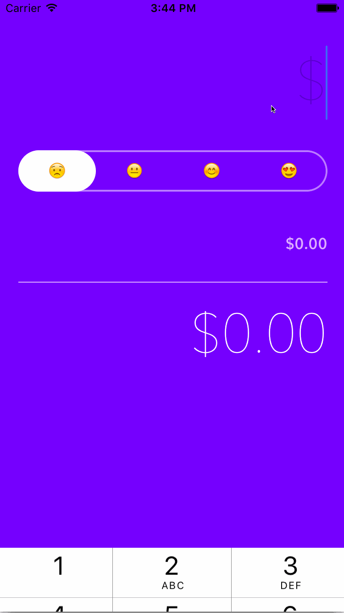

# Emotips
This is a demo iOS app that calculates a tip based on how you feel

Time spent: 6 hours spent in total 

Notes:

Learned how to implement custom segmented controls with a bit of animation from here: http://www.appdesignvault.com/custom-segmented-control-swift-tutorial/

Walkthrough of all user stories:

- calculates the proper tip based on bill total entered
- used custom fonts
- created custom segmented control with animation

GIF created with [LiceCap](http://www.cockos.com/licecap/).
